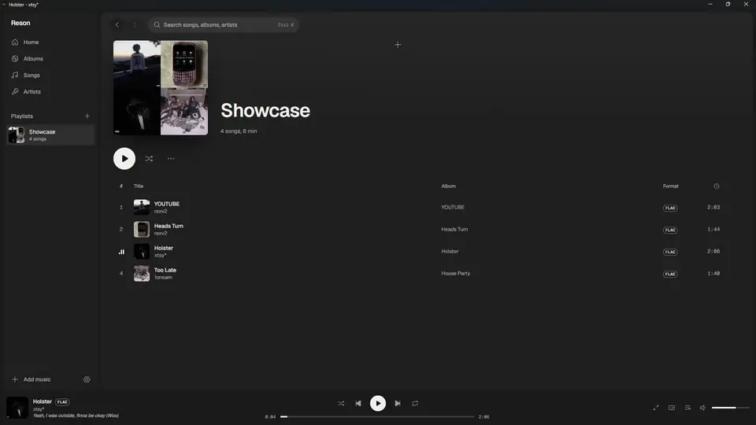
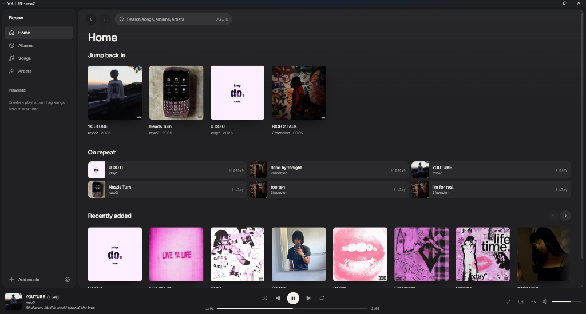
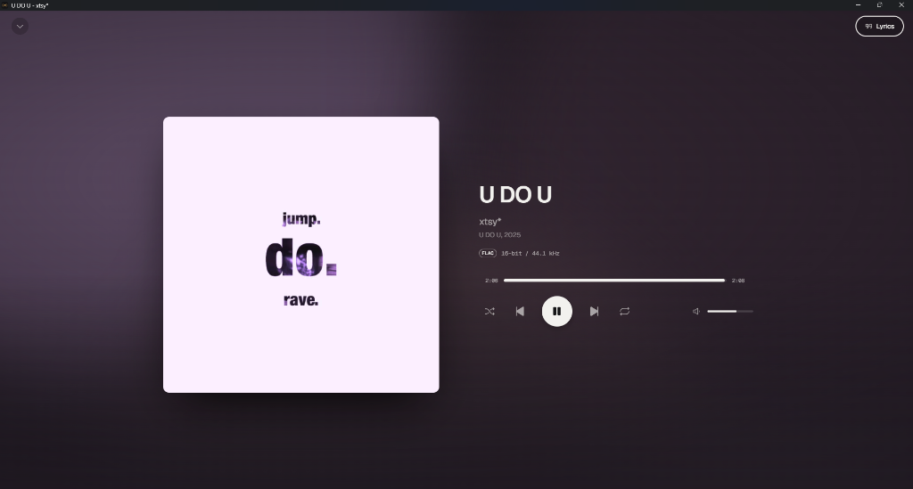
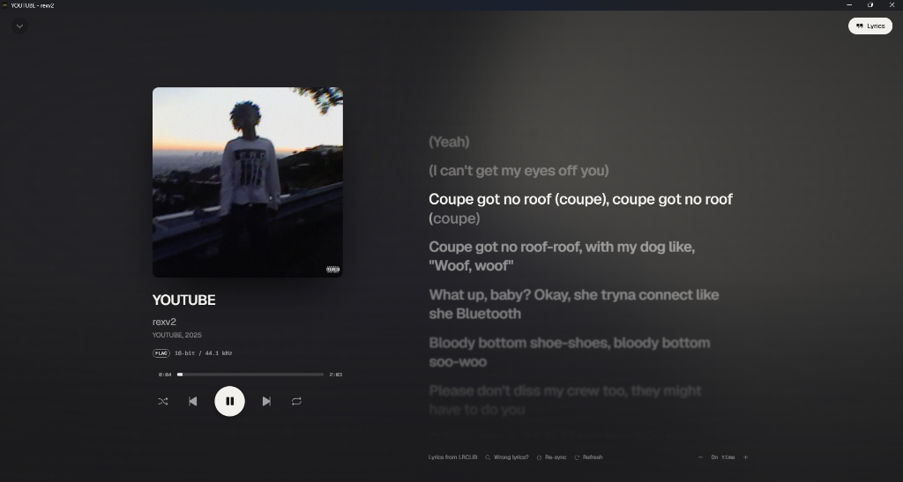
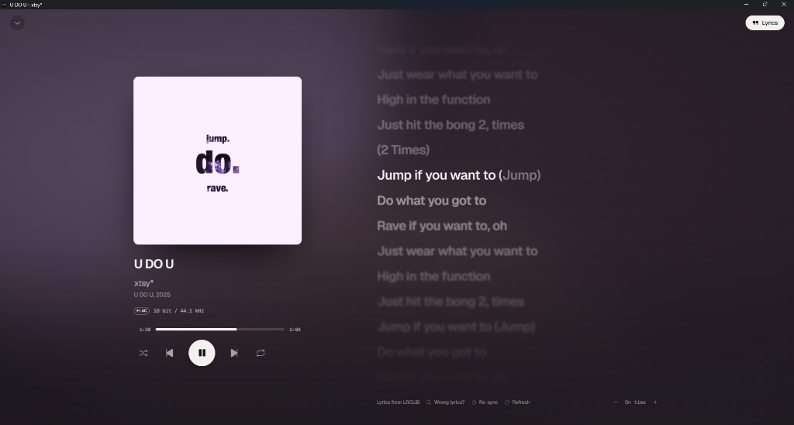

<div align="center">

# Reson

**A desktop music player for the files you own.**

Rust plays the audio, React draws the interface, and the whole app recolors itself
from the album art of whatever you're listening to.

[](LICENSE)


[](https://github.com/osfv/Reson/releases/latest)

**[Download for Windows](https://github.com/osfv/Reson/releases/latest)**



</div>

No account, no server, no streaming. Point Reson at a folder of FLACs or MP3s and it builds your library: covers, colors, lyrics and all.

## Screenshots

<table>
  <tr>
    <td width="50%"></td>
    <td width="50%"></td>
  </tr>
  <tr>
    <td align="center"><sub>Home: jump back in, on repeat, recently added</sub></td>
    <td align="center"><sub>Now Playing takes its colors from the cover</sub></td>
  </tr>
  <tr>
    <td width="50%"></td>
    <td width="50%"></td>
  </tr>
  <tr>
    <td align="center"><sub>Synced lyrics from LRCLIB, with karaoke fill on the current line</sub></td>
    <td align="center"><sub>Lines away from the current one soften with depth blur</sub></td>
  </tr>
</table>

## Why Reson

- **It looks like your music.** Reson pulls a palette from each cover and fades the whole interface to it, with contrast checks so text stays readable on any artwork.
- **Lyrics that keep time.** Synced lyrics arrive on their own, the current word fills as it's sung, and you can click any line to jump there.
- **It tells you what your files really are.** Reson reads the audio inside the file, so an AAC renamed to `.mp3` shows up as AAC, and a 24-bit/96 kHz FLAC says so.
- **It sounds right.** Gapless playback, optional crossfade, loudness normalization, a 10-band EQ with AutoEQ headphone profiles, and bit-perfect WASAPI exclusive mode.
- **It catches fake lossless.** A background check flags FLACs that were made from MP3s, and "hi-res" files upsampled from CD.

## Features

<details open>
<summary><b>Playback</b></summary>

- Gapless playback and optional crossfade (0 to 12 seconds)
- Loudness normalization from ReplayGain tags, or measured in the background when a file has none
- Short fades on pause, resume and seek, so you never hear a pop
- 10-band equalizer with presets, a live response curve, and [AutoEQ](https://autoeq.app) headphone profiles
- Pick any output device, or use WASAPI exclusive mode: each song plays at its own sample rate, bit-perfect at 100% volume
- Queue with drag-to-reorder, shuffle, repeat one or all, and play history
- Windows media overlay, hardware media keys, and play controls in the taskbar preview
- Mini player that stays on top, plus a tray icon
</details>

<details open>
<summary><b>Lyrics</b></summary>

- Sources in order: a `.lrc` file next to the song, lyrics in the file's tags, then [LRCLIB](https://lrclib.net)
- Duration matching, so a remix or live version doesn't get the wrong lyrics
- Word-by-word karaoke fill and Apple-style depth blur
- Scroll freely; a "Sync lyrics" button takes you back to the current line
- Per-song timing offset when lyrics run early or late
- Manual LRCLIB search when the automatic match misses
- Tap-to-sync editor for songs with plain lyrics, with optional publishing back to LRCLIB
- Current line in the player bar while you browse
</details>

<details open>
<summary><b>Library</b></summary>

- Import folders or files, or drop them on the window
- Watched folders pick up new downloads
- Content-based format detection with bit depth, sample rate, bitrate and channels in Song info
- Fake-lossless check: spots lossless files whose audio stops where an MP3 encoder would cut it
- Liked songs: tap the heart anywhere, or drag songs onto Liked songs
- Embedded cover art, or `cover.jpg` / `folder.jpg` next to the files
- Move your files and Reson relinks them, keeping history, playlists and lyric timing
- Albums, artists, songs, playlists, search (`Ctrl+K`) and a Home screen
</details>

<details open>
<summary><b>Look and feel</b></summary>

- Now Playing backdrop built from the cover's palette, with an optional beat pulse and spectrum bars
- Cover morph between the album grid and the album page
- Smooth per-frame progress, so the seek bar and lyrics never step
- Respects your system's reduced-motion setting
</details>

<details open>
<summary><b>Statistics and sharing</b></summary>

- Statistics for each year: top songs, artists and albums, minutes listened, your biggest month and longest streak, plus an animated recap
- Save your year as an image to post anywhere
- Discord status showing what you're playing, with a "Try Reson today" button, through your own Discord app (a setup window walks you through it)
- Last.fm scrobbling with your own free API account, queued while you're offline
- Updates itself from GitHub releases, with signed installers
</details>

**Formats:** FLAC, ALAC, MP3, AAC/M4A, OGG Vorbis, Opus, WAV, Monkey's Audio (APE) and WavPack.

## Download

Grab **`Reson_x.y.z_x64-setup.exe`** from the [latest release](https://github.com/osfv/Reson/releases/latest) (Windows 10 and 11, 64-bit). It installs for your user account, no admin needed.

The installer isn't code-signed yet, so Windows SmartScreen may warn you. Click **More info**, then **Run anyway**. The release notes list SHA-256 hashes if you want to check the file.

Then click **Add music** in the sidebar, or drag a folder onto the window.

## Building from source

You need:

- [Rust](https://rustup.rs) (stable)
- [Node.js](https://nodejs.org) 20 or newer
- The [Tauri prerequisites](https://tauri.app/start/prerequisites/) for your OS (Windows 10 and 11 already ship WebView2)

```sh
git clone https://github.com/osfv/Reson.git
cd Reson
npm install
npm run tauri dev     # run with hot reload
npm run tauri build   # release build and installer in src-tauri/target/release/bundle
```

## Keyboard shortcuts

| Key | Action |
|---|---|
| `Space` | Play / pause |
| `Ctrl` `←` / `→` | Previous / next track |
| `Alt` `←` / `→` | Back / forward |
| `Ctrl` `K` | Search |
| `L` | Toggle lyrics in Now Playing |
| `Esc` | Close Now Playing, menus and dialogs |

## Privacy

Your library stays in a local SQLite database. Reson talks to the network only for these, and you can turn each one off in Settings:

- **Lyrics:** for songs you open the lyrics view on (or play, if the player bar lyric is on), it sends [LRCLIB](https://lrclib.net) the song's title, artist, album and length. Publishing lyrics is opt-in and public.
- **Discord status:** off until you connect your own Discord app. It talks to the Discord app on your PC. To show album art, it looks the album and artist up on Apple's iTunes Search. Covers that aren't on iTunes are uploaded to a temporary host ([uguu.se](https://uguu.se), or [Litterbox](https://litterbox.catbox.moe) as a fallback) that deletes them within 3 days, because Discord only shows images from the web. You can turn album art off.
- **Last.fm:** off until you add your own API key and connect your account. Your keys stay on your PC; Reson sends what you play.
- **Updates:** checks Reson's GitHub releases a couple of times a day. Nothing installs without you clicking Update.

## Platform support

Reson is developed and tested on Windows. Tauri also runs on macOS and Linux, but nobody has tried Reson there yet. Reports and fixes are welcome.

## Contributing

Issues and pull requests are welcome. Before opening a PR, run:

```sh
npm run typecheck
cd src-tauri && cargo test
```

[`AGENTS.md`](AGENTS.md) explains how the app fits together: the audio engine, library import, lyrics lookup and theming.

## Built with

[Tauri 2](https://tauri.app) · [rodio](https://github.com/RustAudio/rodio) and [Symphonia](https://github.com/pdeljanov/Symphonia) · [lofty](https://github.com/Serial-ATA/lofty-rs) · [rusqlite](https://github.com/rusqlite/rusqlite) · React 19 · Tailwind CSS 4 · [Motion](https://motion.dev) · [Phosphor Icons](https://phosphoricons.com) · lyrics from [LRCLIB](https://lrclib.net)

## License

[MIT](LICENSE)
